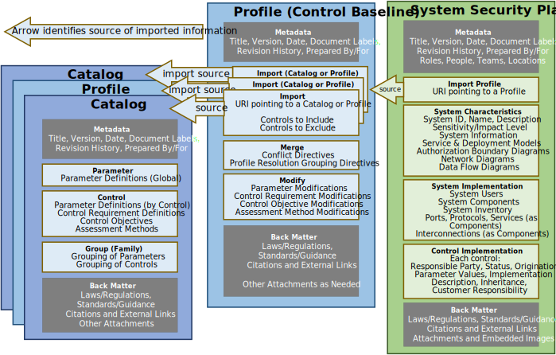

| SSP Schema | SSP Converters 
|:--- |:--- |
| [XML](https://raw.githubusercontent.com/usnistgov/OSCAL/master/xml/schema/oscal_ssp_schema.xsd), [JSON](https://raw.githubusercontent.com/usnistgov/OSCAL/master/json/schema/oscal_ssp_schema.json) | [XML to JSON](https://raw.githubusercontent.com/usnistgov/OSCAL/master/json/convert/oscal_ssp_xml-to-json-converter.xsl), [JSON to XML](https://raw.githubusercontent.com/usnistgov/OSCAL/master/xml/convert/oscal_ssp_json-to-xml-converter.xsl)

## Purpose

The OSCAL system security plan (SSP) model represents a description of the control implementation of an information system. The SSP model is part of the OSCAL [implementation](../) layer.

The OSCAL SSP model enables full modeling of highly granular SSP content, including points of contact, system characteristics, and control satisfaction descriptions. At a more detailed level, this includes the system's authorization boundary, information types and categorization, inventory, and attachments. In terms of control satisfaction, it models control parameter values, responsible roles, implementation status, control origination, and a description of control satisfaction at a level of granularity down to a specific control statement. Control satisfaction can be defined for the system as a whole or for individual implemented components.

## Authors and Consumers

### SSP Authors

System Owners and System Security Plan Authors

Through delegation, system owners create and maintain SSP content to document the implementation of controls within their system.

### SSP Consumers

Assessors, Customers, Authorizing Officials, Leveraging System Owners

Assessors consume SSPs in the planning and execution of a system assessment relative to an established control baseline and compliance framework. 
Authorizing Officials consume SSPs in the adjudication of a system as part of approving an authorization to operate.

## Model Overview

{}
{}
{}
An OSCAL profile is organized as follows:
- **Metadata**: Metadata syntax is identical and required in all OSCAL models. It includes information such as the document's title, publication version, publication date, and OSCAL version. Metadata is also used to define roles, parties (people, teams and organizations), and locations.
- **Import Profile**: Identifies the applicable control baseline for the system. This baseline is represented as an OSCAL [profile](../../profile-layer/profile/).
- **System Characteristics**: Represents attributes of the system, such as its name, description, models, and information processed.
- **System Implementation**: Represents relevant information about the system's deployment, including user roles, interconnections, services, and system inventory. 
- **Control Implementation**: Describes how each control in the baseline is implemented within the system. 
- **Back Matter**: Back matter syntax is identical in all OSCAL models. It is used for attachments, citations, and embedded content such as graphics. 
{}
{}

{}
{}
{}

## Key Concepts

The OSCAL system security plan (SSP) model represents a description of the control implementation of an information system. The SSP model is part of the OSCAL [implementation](../) layer.

The OSCAL SSP model enables full modeling of highly granular SSP content, including points of contact, system characteristics, and control satisfaction descriptions. At a more detailed level, this includes the system's authorization boundary, information types and categorization, inventory, and attachments. In terms of control satisfaction, it models control parameter values, responsible roles, implementation status, control origination, and a description of control satisfaction at a level of granularity down to a specific control statement. Control satisfaction can be defined for the system as a whole or for individual implemented components.

The figure below expresses represents the portion of the OSCAL stack as it relates to an OSCAL SSP.

**IMPORTANT NOTE TO DEVELOPERS**

Every time the content of an OSCAL file changes, the following must also change:
- A new UUID value must be generated and assigned to the root element's `uuid`.
- The `last-modified` field in metadata must be assigned with the date and time at the moment the file is saved with the modified content.

These are two mechanisms by which tools can quickly "know" if a file has changed since it was last encountered.

When converting between formats, such as XML to JSON, these values should remain the same. This enables tools to know the content within the two formats is equivalent.

## Content Examples

Multiple examples of SSP expressed using the OSCAL SSP model can be found in the OSCAL GitHub repository in [XML](https://github.com/usnistgov/oscal-content/tree/master/ssp-example/xml), 
[JSON](https://github.com/usnistgov/oscal-content/tree/master/ssp-example/json),
and [YAML](https://github.com/usnistgov/oscal-content/tree/master/ssp-example/yaml/) formats.
